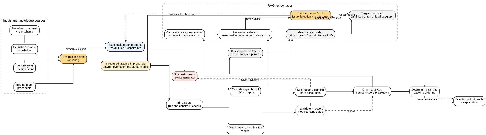
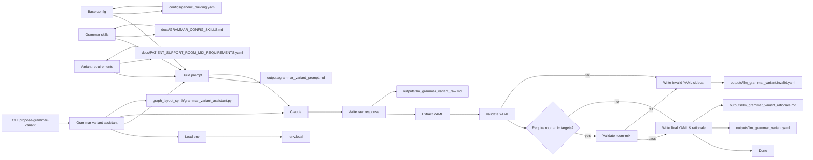

# GraphLayoutSynth

GraphLayoutSynth is an early-stage Python research prototype for generating and evaluating building layout graphs with stochastic graph-grammar rules.

It represents layouts as attributed NetworkX graphs:

- nodes are spaces such as floors, zones, corridors, patient rooms, and support rooms
- edges are relationships such as door connections or wall adjacencies
- deterministic validation and metric-based ranking are the source of truth
- optional Claude workflows can interpret reports or propose YAML config variants, but do not rank, repair, generate raw graphs, or certify layouts

Generated graphs are research prototypes. They are not geometric plans, construction documents, building-code checks, life-safety checks, or compliance-certified layouts.



## Current Pipeline

```text
YAML configuration and grammar_rules
  -> stochastic NetworkX graph generation
  -> rule-application tracing
  -> rule-based validation
  -> deterministic metric ranking
  -> candidate review summaries for human/RAG inspection
  -> diversity and novelty metrics over review-summary features
  -> JSON/CSV reports, trace files, summaries, and optional PNG visualization
  -> optional Claude interpretation of deterministic reports or YAML config-variant proposal
```

The package is `graph_layout_synth`. The CLI entry point is:

```bash
python -m graph_layout_synth
```

## Installation

Use the local project environment if available:

```bash
mamba activate musa-550-fall-2024
python -m pip install -e ".[dev]"
```

Core dependencies are NetworkX, PyYAML, and Matplotlib. Development installs also include pytest.

FastAPI and Uvicorn are included for the optional NextRoomPredictor HTTP integration described below.

Install optional Claude support only when you need LLM report interpretation or LLM grammar-variant proposal:

```bash
python -m pip install -e ".[llm]"
```

Create `.env.local` at the repository root for local Claude evaluation:

```text
ANTHROPIC_API_KEY=your_api_key_here
```

Do not commit `.env.local`. The committed `.env.example` contains only an empty placeholder.

## NextRoomPredictor HTTP API

Start the local API after installing the project:

```bash
python -m uvicorn server.main:app --reload --port 8000
```

The service exposes:

- `GET /health`
- `POST /suggest-next-room`
- `GET /program-requirements/room-types`
- `POST /program-requirements/validate`
- optional feature-gated grammar variant endpoints:
  - `POST /grammar-variants/propose`
  - `POST /grammar-variants/propose-from-instructions`
  - `GET /grammar-variants`
  - `GET /grammar-variants/{variant_id}`
  - `POST /grammar-variants/{variant_id}/activate`

NextRoomPredictor should call the suggestion endpoint only when the user clicks a `+` handle. The v1 API predicts semantic/topological neighbor room types; it does not accept a required `side` or direction and does not return geometry. The frontend keeps responsibility for clicked-side placement and overlap validation.

Suggestions are still aggregated and ranked by `roomType`. Each suggestion may
also include optional `edgeType` and `edgeTypeCounts` fields derived from the
generated extra-neighbor relations. `edgeType` is the dominant observed
connection type, currently `door` or `wall`, with `door` preferred on ties.
NextRoomPredictor can use `edgeType` when creating the new adjacency edge; if
it is missing, existing frontend fallback behavior remains valid.

Suggestions may additionally include optional `intendedEdges`: secondary
relationships from the suggested new room to rooms already present in the
submitted floorplan (for example, a new patient room that should also connect
to an existing corridor by a door). Intended edges are reported only when the
generated graph samples actually contain that edge — no room-type rule is
hard-coded — and the field is omitted when there is no evidence, so existing
clients keep working unchanged. See
[the API contract](docs/contracts/suggest-next-room-api.md) for field details.

The default allowed browser origin is `http://localhost:5173`. Add comma-separated local origins with `NEXT_ROOM_ALLOWED_ORIGINS`.

The suggestion endpoint uses `configs/generic_building.yaml` by default. To
test against a generated grammar variant, set the config path before starting
the API:

```powershell
$env:GRAPHLAYOUTSYNTH_GRAMMAR_MODE = "env_config"
$env:GRAPHLAYOUTSYNTH_SUGGESTION_CONFIG = "outputs/llm_grammar_variant.yaml"
python -m uvicorn server.main:app --reload --port 8000
```

See [the NextRoomPredictor integration guide](docs/integration/nextroompredictor-api.md) for the request contract, curl example, response, validation behavior, and current generator-adapter boundary.

### Suggestion debug artifacts

Suggestion requests do not write files by default. To save the raw generated
graphs and matching/aggregation diagnostics for one request, add:

```json
{
  "includeDebugArtifacts": true,
  "includeDebugVisualizations": true
}
```

Both fields are optional. `includeDebugVisualizations` also enables the JSON
artifact run. To enable saving server-wide instead, set:

```powershell
$env:GRAPHLAYOUTSYNTH_SAVE_SUGGESTION_ARTIFACTS = "true"
$env:GRAPHLAYOUTSYNTH_SAVE_SUGGESTION_PNGS = "true"
$env:GRAPHLAYOUTSYNTH_SUGGESTION_ARTIFACT_DIR = "outputs/nextroom_suggestions"
```

Each enabled request creates a timestamped, collision-resistant subdirectory.
It contains the validated request snapshot, raw NetworkX node-link graph JSON,
per-graph semantic matching details, final aggregation metadata, a compact
`README.md`, and optional PNGs. The saved path is logged by the server and is
not added to the public response.

Artifact and PNG failures are logged without failing prediction. Debug saving
can create many files and PNG rendering adds latency, so keep both disabled by
default in production. See
[the integration guide](docs/integration/nextroompredictor-api.md#suggestion-debug-artifacts)
for the complete file list.

## Configuration

The default config is `configs/generic_building.yaml`. It defines:

- project metadata and default random seed
- generation defaults such as candidate count
- allowed node and edge types
- room type counts and stochastic generation settings
- validation settings
- explicit executable `grammar_rules`
- deterministic ranking weights and targets
- visualization colors

Pass another YAML file with `--config` to run the same pipeline with different settings.

### Specifying Generation Variants

Users specify generation variants by choosing or producing a complete YAML
config variant. GraphLayoutSynth does not take raw graph edits or free-form
layout instructions directly into generation; user intent becomes validated
YAML, then normal deterministic generation uses that config.

Manual variants usually start by copying `configs/generic_building.yaml` to a
new file under `outputs/` or another ignored variants directory, editing the
YAML, validating it, then passing it to `generate`:

```powershell
python -m graph_layout_synth validate-config --config outputs/my_variant.yaml

python -m graph_layout_synth generate `
  --config outputs/my_variant.yaml `
  --num-candidates 50 `
  --top-k 5 `
  --seed 44 `
  --visualize `
  --output-dir outputs/variant_run_001
```

LLM-assisted variants use `propose-grammar-variant` to turn structured
requirements or heuristic instructions into a complete YAML config proposal.
Use `--no-call` to inspect the prompt without calling Claude:

```powershell
python -m graph_layout_synth propose-grammar-variant `
  --base-config configs/generic_building.yaml `
  --variant-requirements docs/PATIENT_SUPPORT_ROOM_MIX_REQUIREMENTS.yaml `
  --write-prompt outputs/grammar_variant_prompt.md `
  --no-call
```

For a live proposal, write the validated YAML variant and then use it with
normal generation:

```powershell
python -m graph_layout_synth propose-grammar-variant `
  --base-config configs/generic_building.yaml `
  --variant-requirements docs/PATIENT_SUPPORT_ROOM_MIX_REQUIREMENTS.yaml `
  --output-config outputs/llm_grammar_variant.yaml `
  --rationale-output outputs/llm_grammar_variant_rationale.md `
  --raw-output outputs/llm_grammar_variant_raw.md

python -m graph_layout_synth generate --config outputs/llm_grammar_variant.yaml
```

The optional HTTP grammar-variant control plane can also accept
`heuristicInstructions`, optional `baseConfigPath`, optional structured
`variantRequirements`, optional user-facing `programRequirements` with an
optional internal `constraintProfile`, `dryRun`, and `activateIfValid` through
`POST /grammar-variants/propose`. Activated variants affect API suggestions
only when the server runs with:

```powershell
$env:GRAPHLAYOUTSYNTH_GRAMMAR_MODE = "active_variant"
```

Important: `GRAPHLAYOUTSYNTH_GRAMMAR_MODE=active_variant` selects the config
used by the `/suggest-next-room` API sampler. It does not change CLI graph
generation. For CLI generation, always pass the variant explicitly with
`--config`.

## Program Requirements Preflight

Users can express program data as a small user-facing YAML/JSON schema:
room types with `min`/`target`/`max` counts plus optional high-level
adjacency preferences. Backend generation parameters (local group sizes,
corridor hub/degree limits, relaxation limits) are internal
`GenerationConstraintProfile` values and are never asked from users.

A deterministic, LLM-independent preflight validator checks whether the
requested program is satisfiable under the internal constraint profile and
the active config vocabulary, and reports one of three feasibility states:
`feasible`, `feasible_with_relaxation`, or `infeasible`. Counts the current
static grammar cannot reach are reported as warnings, since that is the case
a config variant is for.

```powershell
python -m graph_layout_synth validate-program-requirements `
  --requirements docs/program_requirements/example_healthcare_program.yaml `
  --base-config configs/generic_building.yaml `
  --constraints configs/program_constraint_profiles/default_healthcare.yaml `
  --output outputs/program_requirements_validation_report.json
```

`GET /program-requirements/room-types` returns a deterministic, read-only
catalog of the canonical user-facing room types from the active config
vocabulary (the same `ConfigContract` source used by validation). Frontend
dropdowns should use this endpoint instead of hard-coding room type names,
and user-entered names should be mapped to these canonical ids before
validation or generation. It requires no feature flag, never calls the LLM,
and never generates graphs. See `docs/PROGRAM_REQUIREMENTS.md` for the
response shape and config-resolution behavior.

The same validation is exposed as `POST /program-requirements/validate` for
frontend preflight; it never calls the LLM and never generates graphs. When
program requirements are supplied to `propose-grammar-variant` (via
`--program-requirements`) or to `POST /grammar-variants/propose` (via
`programRequirements`), the preflight runs first: errors block the Claude
call, warnings are recorded in the variant artifacts, and validated
requirements are added to the prompt as deterministic design intent. This
feature validates only; it does not change graph generation behavior yet.

See `docs/PROGRAM_REQUIREMENTS.md` for the schema, exclusions (no area,
width, height, or cluster fields in v1), examples, and feasibility-state
semantics.

## Grammar Config Validation

Validate grammar configs before using them for generation, especially when a YAML variant was proposed by Claude or another LLM:

```bash
python -m graph_layout_synth validate-config --config configs/generic_building.yaml
```

You can also write a small JSON validation report:

```bash
python -m graph_layout_synth validate-config \
  --config outputs/llm_grammar_variant.yaml \
  --output outputs/config_validation_report.json
```

The Claude-facing instruction document for schema-valid YAML variants is `docs/GRAMMAR_CONFIG_SKILLS.md`. Read it before modifying `grammar_rules` or asking an LLM to propose config variants.

Validation reports include a compact `contract_summary` with the derived vocabulary and consistency context, including `room_mix_reachable_ranges` computed from grammar-rule zone counts and per-zone room counts.

### Config Contract

GraphLayoutSynth derives a live config contract from the YAML config. The validator and LLM prompt builder use this contract so allowed node types, edge types, semantic groups, room-mix targets, reachable room-mix ranges, typed accessibility pairs, and grammar-rule context stay synchronized when the config changes. `docs/GRAMMAR_CONFIG_SKILLS.md` describes the generic format; the live contract provides the current config-specific vocabulary.

## LLM Grammar Variants

The optional `propose-grammar-variant` command asks Claude to propose a complete YAML config variant. Claude does not generate raw graphs, does not overwrite the base config, and does not bypass validation. The generated config is validated before it is saved as the normal output config.

When asking for specific room mixes, prefer config-defined `room_mix_targets` and `semantic_node_groups` so the prompt and semantic checks share the same parameters. A separate `--variant-requirements` YAML/JSON file can still be used for run-specific overrides.

The grammar-variant prompt includes a machine-readable `Live Config Contract` section derived from the actual base config. If a variant introduces a new node type or edge type, the generated YAML must update every relevant config section consistently.

### HTTP LLM Variant Control Plane

The CLI workflow remains available. GraphLayoutSynth also exposes an optional
HTTP control plane for proposing, listing, inspecting, and activating validated
grammar/config variants. It is disabled by default:

```powershell
$env:GRAPHLAYOUTSYNTH_ENABLE_LLM_VARIANTS = "true"
$env:GRAPHLAYOUTSYNTH_LLM_VARIANT_DIR = "outputs/llm_variants"
python -m uvicorn server.main:app --reload --port 8000
```

Endpoints:

- `POST /grammar-variants/propose`
- `GET /grammar-variants`
- `GET /grammar-variants/{variant_id}`
- `POST /grammar-variants/{variant_id}/activate`

`POST /grammar-variants/propose` accepts `heuristicInstructions`, optional
`baseConfigPath`, optional structured `variantRequirements`, optional
user-facing `programRequirements` plus an optional internal
`constraintProfile`, optional `model`, `dryRun`, and `activateIfValid`. Dry
runs write the prompt without calling Claude or requiring
`ANTHROPIC_API_KEY`. Live proposals save structured artifacts under
`outputs/llm_variants/<variant_id>/` and update
`outputs/llm_variants/registry.json`.

Each proposal directory contains files such as `metadata.json`,
`heuristic_instructions.md`, `base_config_path.txt`, `prompt.md`,
`raw_llm_response.md`, `extracted_variant.yaml`, `validated_variant.yaml`,
`invalid_variant.yaml`, `validation_report.json`, and `rationale.md` when
available. When `programRequirements` are supplied, the directory also holds
`submitted_program_requirements.json`, normalized `program_requirements.yaml`,
`program_constraint_profile.yaml`, and
`program_requirements_validation.json`; preflight errors block the Claude
call and record a failed variant. Invalid or failed variants are recorded but
cannot be activated. Activation writes
`outputs/llm_variants/active_variant.json`.

Suggestion config selection is controlled separately:

```powershell
$env:GRAPHLAYOUTSYNTH_GRAMMAR_MODE = "static"         # default
$env:GRAPHLAYOUTSYNTH_GRAMMAR_MODE = "env_config"    # uses GRAPHLAYOUTSYNTH_SUGGESTION_CONFIG
$env:GRAPHLAYOUTSYNTH_GRAMMAR_MODE = "active_variant"
```

If `GRAPHLAYOUTSYNTH_GRAMMAR_MODE` is omitted, the API preserves existing
behavior: it uses `GRAPHLAYOUTSYNTH_SUGGESTION_CONFIG` when that path is set,
otherwise it uses `configs/generic_building.yaml`. The LLM never generates raw
NetworkX graphs and `/suggest-next-room` never calls the LLM directly.

Prompt-only dry run:

```bash
python -m graph_layout_synth propose-grammar-variant \
  --base-config configs/generic_building.yaml \
  --diversity-report outputs/diversity_report.json \
  --review-summary outputs/review_summary.json \
  --archive-path outputs/final_output_archive.json \
  --write-prompt outputs/grammar_variant_prompt.md \
  --no-call
```

Live Claude proposal:

```bash
python -m graph_layout_synth propose-grammar-variant \
  --base-config configs/generic_building.yaml \
  --diversity-report outputs/diversity_report.json \
  --review-summary outputs/review_summary.json \
  --archive-path outputs/final_output_archive.json \
  --output-config outputs/llm_grammar_variant.yaml \
  --rationale-output outputs/llm_grammar_variant_rationale.md \
  --raw-output outputs/llm_grammar_variant_raw.md
```

### LLM Variant Workflow

The CLAUDE-based variant proposal follows this flow (prompt building → Claude call → extract YAML → validate → optional semantic checks → write outputs). See `docs/FLOWCHART.md` for the diagram and a printable Mermaid block.



Then validate and run the normal generator:

```bash
python -m graph_layout_synth validate-config --config outputs/llm_grammar_variant.yaml

python -m graph_layout_synth generate \
  --config outputs/llm_grammar_variant.yaml \
  --num-candidates 50 \
  --top-k 5 \
  --seed 44 \
  --visualize \
  --output-dir outputs/variant_run_001 \
  --archive-path outputs/final_output_archive.json
```

If Claude returns invalid YAML, a schema-invalid config, or a config that fails enabled structured requirements such as room-mix targets, the CLI saves the invalid YAML as a sidecar such as `outputs/llm_grammar_variant.invalid.yaml` and exits nonzero. Invalid variants should not be used for generation.

## Instruction-Guided Config Variants

`propose-instruction-variant` is a research CLI workflow that tests whether
Claude can translate a markdown/text file of researcher-written design
instructions into a valid YAML config variant, reusing the same
grammar-variant assistant prompt-building and validation infrastructure.
Claude proposes YAML only; it never generates graphs, and deterministic
GraphLayoutSynth code validates every proposal and, optionally, generates
samples from the first one that validates.

```bash
python -m graph_layout_synth propose-instruction-variant \
  --instructions docs/design_instructions/inpatient_unit_rules.md \
  --base-config configs/generic_building.yaml \
  --output-dir outputs/instruction_variants/inpatient_unit_live_02 \
  --samples 25 \
  --repair-attempts 2
```

Use `--no-call` to write the prompt without calling Claude. If the initial
proposal fails deterministic validation, `--repair-attempts N` sends it back
to Claude with the validation errors up to `N` times, stopping at the first
attempt that validates; `--repair-attempts 0` (the default) preserves the
original one-shot behavior. If every attempt remains invalid, every proposal
is saved for inspection but no graphs are generated. See
`docs/INSTRUCTION_GUIDED_VARIANTS.md` for the full artifact list, prompt
contents, and limitations.

The same workflow is exposed over HTTP as
`POST /grammar-variants/propose-from-instructions`, gated the same way as
the rest of `/grammar-variants/*` (`GRAPHLAYOUTSYNTH_ENABLE_LLM_VARIANTS=true`,
including dry runs). A valid instruction-guided proposal is registered as a
normal grammar variant — no second registry — so it is immediately visible
via `GET /grammar-variants`, inspectable via `GET /grammar-variants/{id}`,
and activatable via `POST /grammar-variants/{id}/activate`. Claude is called
only for this one endpoint with `dryRun=false` and non-empty
`instructionText`; `/suggest-next-room`, the room-type catalog, program
validation, and variant listing/inspection/activation never call it. See
`docs/INSTRUCTION_GUIDED_VARIANTS.md#http-endpoint` for the request/response
shapes.

## Grammar Rules

`grammar_rules` are a small executable YAML rule schema, not a full graph-grammar formalism. Rules match nodes by exact attribute values, then update matched nodes, create nodes, create edges, and optionally remove the matched node.

Supported features include:

- simple node-attribute matching, such as `type: Zone` and `is_abstract: true`
- fixed counts, such as `count: 1`
- stochastic min/max counts, such as `count: {min: 3, max: 5}`
- stochastic choices, such as `type: {choices: [PatientRoom, ClinicalSupport]}`
- created-node aliases for edge creation
- edge modes: `one_to_one`, `each_to_one`, `one_to_each`, and `adjacent_pairs`
- the special `matched` alias, plus `__neighbors__` for existing neighbors

Example:

```yaml
grammar_rules:
  - name: expand_zone_to_room_cluster
    match:
      type: Zone
      is_abstract: true
    action:
      remove_matched_node: true
      create_nodes:
        - alias: corridor
          type: Corridor
          count: 1
          attributes:
            is_abstract: false
        - alias: room
          type:
            choices:
              - PatientRoom
              - ClinicalSupport
              - StaffSupport
          count:
            min: 3
            max: 5
          attributes:
            is_abstract: false
      create_edges:
        - source: corridor
          target: __neighbors__
          edge_type: door
          mode: one_to_each
        - source: room
          target: corridor
          edge_type: door
          mode: each_to_one
        - source: room
          target: room
          edge_type: wall
          mode: adjacent_pairs
```

The generator still contains older built-in expansion helpers, but config-defined grammar rules are used when present.

## Rule Application Tracing

The `generate` command exports a lightweight rule-application trace for each generated candidate. Trace files show how a candidate was produced, including the rule applied at each step, the matched node and attributes, sampled counts and choices, created nodes, created edges, and removed nodes.

Tracing is useful for debugging grammar behavior, explaining why two seeded candidates differ, and giving deterministic reports more provenance without changing ranking behavior.

Trace artifacts are saved under `--output-dir` alongside graph and report files:

- `candidate_<n>_trace.json` and `candidate_<n>_trace.md` for every generated candidate
- `best_candidate_trace.json` and `best_candidate_trace.md` for the top-ranked candidate
- `top_<rank>_candidate_<n>_trace.json` and `.md` for each exported top-k candidate

Candidate reports and ranking reports include compact trace metadata: `trace_path`, `trace_length`, `applied_rule_names`, and `applied_rule_counts`. Inspect the JSON trace for full step details or the markdown trace for a short human-readable summary.

## Candidate Review Summaries

The `generate` command also exports compact candidate review summaries for human inspection and later RAG-style graph review. These summaries are JSON files that avoid embedding full raw graphs by default while keeping pointers to retrievable artifacts such as graph JSON, candidate reports, traces, images, and the summary file itself.

Each candidate summary includes validity status, final score, score breakdown when available, key deterministic metrics, node and edge counts, node and edge type counts, separate support-type counts and ratios such as `ClinicalSupport` and `StaffSupport`, graph degree statistics, typed accessibility metrics, trace metadata, artifact paths, and a wall-adjacency proxy.

The wall-adjacency proxy counts incident `wall` edges for concrete room-like nodes. It is not a geometric corner-room or code-compliance metric. It is a graph-only signal for whether non-corridor rooms have low wall adjacency, because most room-like spaces in this prototype are expected to share walls with at least two neighboring spaces.

The wall-adjacency summary includes aggregate counts and node references such as `low_wall_adjacency_nodes` and `isolated_wall_nodes`, each with `node_id`, `node_type`, `wall_degree`, and available attributes such as `zone`, so later RAG steps can retrieve the relevant graph fragments rather than only seeing pool-level counts.

Typed accessibility metrics summarize shortest-path travel distances between source and target node types using door edges by default. The initial default pair is `PatientRoom` to nearest `ClinicalSupport`. Each pair summary includes reachable and unreachable source counts, min/mean/median/max distances, a distance histogram, and `far_source_nodes` with `node_id`, `node_type`, `nearest_target_id`, and `distance`. These metrics are review context only and are not used for scoring.

Review summary artifacts are saved under `--output-dir`:

- `candidate_<n>_review_summary.json` for each generated candidate
- `review_summary.json` with `pool_summary` and `candidate_summaries`

Ranking report entries include `review_summary_path` so downstream review code can retrieve the compact candidate summary before deciding whether to load full graph, report, trace, or image artifacts.

## Diversity and Novelty Metrics

The `generate` command writes `diversity_report.json` with lightweight diversity and novelty diagnostics. These metrics are review context only; they do not change deterministic ranking, top-k export, or final candidate selection.

Diversity is measured within the current generated candidate batch. Novelty is measured against an optional archive of previously selected final outputs. Both use numeric feature vectors extracted from candidate review summaries rather than raw graph edit distance.

Feature extraction includes graph and report features such as node and edge counts, type counts, degree histograms, trace rule counts, wall-adjacency proxy metrics, and typed accessibility features. For typed accessibility, the current default feature source is the `PatientRoom` to nearest `ClinicalSupport` door-distance histogram and scalar distance fields when present.

The optional archive path can be passed with `--archive-path`. If omitted, generation looks for `final_output_archive.json` under `--output-dir`; if the file does not exist, novelty is computed as if the archive were empty. This branch computes novelty metrics only and does not update the archive automatically.

Archive novelty reports preserve `nearest_archive_distance` as the raw weighted Euclidean distance in normalized feature space. Because that raw distance spans many feature dimensions, it can exceed `1.0`. The exported `novelty_score` is bounded by normalizing that raw distance by the maximum possible weighted Euclidean distance for the active feature dimensions.

Feature-bin coverage reports both global and sample-normalized coverage. `coverage_rate` is occupied bins divided by all possible bins in the configured behavior space. `sample_normalized_coverage_rate` is occupied bins divided by the maximum number of bins this generated sample could have occupied, `min(num_candidates, total_possible_bin_count)`. For small batches, `sample_normalized_coverage_rate` is usually the more interpretable value.

Generation also accepts:

- `--near-duplicate-threshold`: distance threshold for within-batch near-duplicate detection, default `0.05`
- `--low-novelty-threshold`: novelty-score threshold for archive comparison, default `0.10`

## Final Output Archive

The final-output archive stores accepted final graph outputs selected by an explicit selection process, usually an LLM review step. It is used by later generation runs for novelty comparison. The archive is not a record of every generated or top-ranked candidate, and it is not updated automatically during generation.

The preferred archive input is a machine-readable selection file:

```json
{
  "selected_candidate_id": "candidate_3",
  "selection_rationale": "Candidate 3 has strong validity, balanced graph metrics, and useful novelty.",
  "selection_source": "claude",
  "review_context_path": "outputs/llm_evaluation.md"
}
```

Archive a selected final output with:

```bash
python -m graph_layout_synth archive-final \
  --selection outputs/llm_selection.json \
  --output-dir outputs \
  --archive-path outputs/final_output_archive.json \
  --output-id final_run_001
```

The minimal command is:

```bash
python -m graph_layout_synth archive-final \
  --selection outputs/llm_selection.json \
  --output-dir outputs
```

This resolves `selected_candidate_id` to `outputs/<candidate_id>_review_summary.json`, validates the candidate ID, extracts artifact paths, stores selection notes, and writes or updates `outputs/final_output_archive.json`. If `--output-id` is omitted, a timestamp-based id is generated. Duplicate `output_id` values are rejected unless `--allow-duplicate-output-id` is passed.

Direct review-summary archiving is also available for manual or test workflows:

```bash
python -m graph_layout_synth archive-final \
  --review-summary outputs/candidate_3_review_summary.json \
  --notes "Manual final selection." \
  --output-dir outputs
```

## Generate Graphs

Generate ranked candidates:

```bash
python -m graph_layout_synth generate \
  --config configs/generic_building.yaml \
  --num-candidates 5 \
  --top-k 2 \
  --seed 42 \
  --near-duplicate-threshold 0.05 \
  --low-novelty-threshold 0.10 \
  --output-dir outputs
```

Generate ranked candidates with PNG visualizations:

```bash
python -m graph_layout_synth generate \
  --config configs/generic_building.yaml \
  --num-candidates 5 \
  --top-k 2 \
  --seed 42 \
  --visualize \
  --output-dir outputs
```

## Candidate Ranking

Ranking is deterministic and metric-based. Each candidate receives:

- `final_score`
- backward-compatible `ranking_score`
- `score_breakdown`
- `metrics`
- deterministic `tie_break_keys`

Metrics include counts, validation status, corridor access ratio, edge-node ratio, room-corridor ratio, door-wall ratio, corridor fraction, room-to-corridor distances, dead ends, support-room ratio, abstract-node count, and invalid-edge count.

Score components include validation, connectivity, corridor access, edge density, corridor efficiency, door/wall balance, distance efficiency, support mix, and penalties for dead ends, invalid edges, and abstract nodes. Ranking weights and heuristic targets live in the config under `ranking`.

The older simple `score` in candidate reports is generation metadata. Use `final_score`, `score_breakdown`, and `metrics` for deterministic ranking interpretation.

## Outputs

The `generate` command writes these files under `--output-dir`:

- `candidate_<n>.json`: NetworkX node-link JSON for each generated candidate
- `candidate_<n>_report.json`: validation, count, metric, score, trace, and review-summary metadata for each generated candidate
- `candidate_<n>_review_summary.json`: compact structured review summary for each generated candidate
- `review_summary.json`: pool-level and candidate-level review summaries
- `diversity_report.json`: diversity, novelty, and feature-bin coverage metrics
- `final_output_archive.json`: optional archive of accepted final outputs, created by `archive-final`
- `llm_grammar_variant.yaml`: optional Claude-proposed config variant, created by `propose-grammar-variant`
- `llm_grammar_variant_rationale.md` and `llm_grammar_variant_raw.md`: optional Claude rationale/raw response artifacts
- `best_candidate.json`: NetworkX node-link JSON for the top-ranked candidate
- `best_candidate_report.json`: validation, count, metric, and score summary for the top candidate
- `ranking_report.json`: full deterministic ranking report without embedded graph objects
- `ranking_report.csv`: compact tabular ranking report
- `top_<rank>_candidate_<n>.json`: node-link JSON for each top-k candidate
- `top_<rank>_candidate_<n>_report.json`: report for each top-k candidate
- `candidate_<n>_trace.json` and `candidate_<n>_trace.md`: rule-application trace for each generated candidate
- `best_candidate_trace.json` and `best_candidate_trace.md`: trace aliases for the top-ranked candidate
- `top_<rank>_candidate_<n>_trace.json` and `.md`: trace aliases for exported top-k candidates
- `candidate_<n>.png`, `best_candidate.png`, and `top_<rank>_candidate_<n>.png`: optional visualizations when `--visualize` is used

Other commands and the HTTP API write additional optional artifacts under `outputs/`:

- `program_requirements_validation_report.json`: optional preflight report from `validate-program-requirements --output`
- `<output-config-stem>_program_requirements.yaml` and `<output-config-stem>_program_validation.json`: normalized requirements and preflight report saved by `propose-grammar-variant --program-requirements`
- `llm_variants/`: grammar-variant control-plane registry, active-variant pointer, and per-proposal artifact directories
- `nextroom_suggestions/`: timestamped suggestion debug artifact runs when debug saving is enabled

Generated output artifacts are intentionally ignored by git, except `outputs/.gitkeep`.

## Claude LLM Evaluation

The optional `evaluate-llm` command reads deterministic ranking and candidate reports, calls Claude, and writes a markdown interpretation. It can summarize tradeoffs, compare top candidates, and suggest possible repair directions.

It must not be treated as a replacement for deterministic ranking, a code-level correctness check, a graph repair tool, or a building-code/life-safety certification.

Example:

```bash
python -m graph_layout_synth evaluate-llm \
  --ranking-report outputs/ranking_report.json \
  --candidate-reports outputs/top_1_candidate_1_report.json outputs/top_2_candidate_2_report.json \
  --output outputs/llm_evaluation.md \
  --model claude-sonnet-4-6 \
  --env-path .env.local
```

The exact top-k candidate report names depend on the generated ranking.

## Development

Run tests:

```bash
python -m pytest
```

Run a smoke test:

```bash
python -m graph_layout_synth generate \
  --config configs/generic_building.yaml \
  --num-candidates 5 \
  --top-k 2 \
  --seed 42 \
  --visualize \
  --output-dir outputs
```

Tests must not make live Anthropic API calls. LLM-related tests should mock or isolate the optional API boundary.

## Package Map

- `graph_layout_synth/config.py`: YAML loading, validation, and typed config dataclasses
- `graph_layout_synth/config_contract.py`: live config-derived vocabulary, semantic groups, room-mix targets, and reachable room-count ranges
- `graph_layout_synth/config_validator.py`: user-facing config validation reports for CLI and tests
- `graph_layout_synth/rule_schema.py`: executable YAML grammar rule validation and application
- `graph_layout_synth/grammar.py`: seed graph and expansion orchestration
- `graph_layout_synth/generator.py`: candidate generation and generation metadata
- `graph_layout_synth/validators.py`: graph validity checks
- `graph_layout_synth/scoring.py`: legacy/simple generation score
- `graph_layout_synth/ranking.py`: deterministic candidate metrics, scoring, and ranking
- `graph_layout_synth/review_summary.py`: compact candidate and pool review summaries for human/RAG inspection
- `graph_layout_synth/diversity.py`: diversity feature extraction, pairwise diversity, archive novelty, and feature-bin coverage
- `graph_layout_synth/archive.py`: explicit final-output archive creation from selection files or review summaries
- `graph_layout_synth/program_requirements.py`: user-facing program requirements schema, loaders, and local validation
- `graph_layout_synth/generation_constraint_profile.py`: backend/internal generation constraint profiles
- `graph_layout_synth/program_preflight.py`: deterministic program-requirements feasibility preflight
- `graph_layout_synth/grammar_variant_assistant.py`: optional Claude workflow for proposing validated YAML config variants
- `graph_layout_synth/grammar_variant_control_plane.py`: feature-gated HTTP control plane for proposing, recording, and activating validated variants
- `graph_layout_synth/api/`: NextRoomPredictor request/response models, frontend↔internal ID adapter, semantic anchor matching, neighbor and intended-edge aggregation, sampler config selection, predictor service, and suggestion debug artifacts
- `server/main.py`: FastAPI application exposing health, next-room suggestion, program-requirements validation, and grammar-variant endpoints
- `graph_layout_synth/export.py`: graph, candidate report, and ranking report export
- `graph_layout_synth/visualize.py`: static PNG graph visualization
- `graph_layout_synth/tracing.py`: rule-application trace event and trace export helpers
- `graph_layout_synth/llm_evaluator.py`: optional Claude interpretation of deterministic reports
- `graph_layout_synth/cli.py`: `generate`, `validate-config`, `validate-program-requirements`, `propose-grammar-variant`, `propose-instruction-variant`, `archive-final`, and `evaluate-llm` commands
